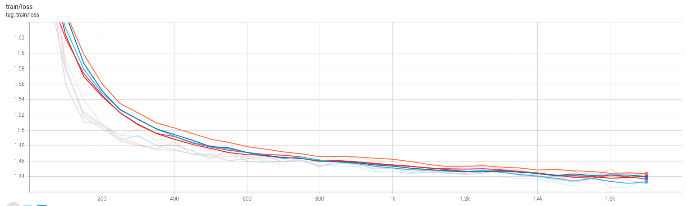
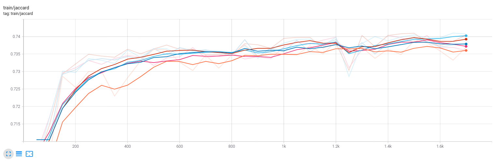
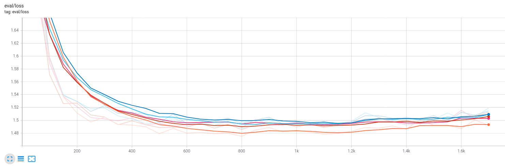
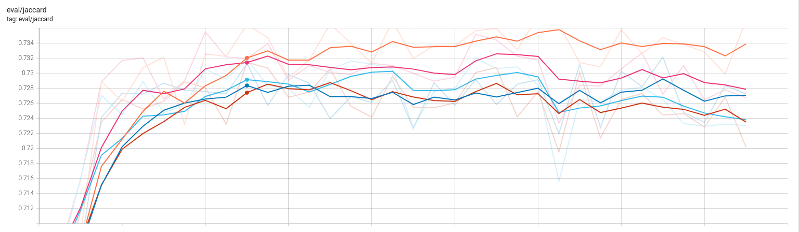

# Tweet Sentiment Extraction Kaggle Competition
Reimplementation of the winning model.

This repo hosts a reimplementation of a model of the [winning team](https://www.kaggle.com/c/tweet-sentiment-extraction/discussion/159477) (private score: 0.7362).
The aim of the competition was to predict, given a text and a sentiment (positive, neutral, negative), the substring "selected_text" which reflects the sentiment:

| textID | text | selected_text | sentiment |
|----|----|----|----|
| cb774db0d1 | " I`d have responded, if I were going" | "I`d have responded, if I were going" | neutral
| 549e992a42 | Sooo SAD I will miss you here in San Diego!!! | Sooo SAD | negative

The Question Answering task is well suited for this competition. In Question Answering, the model is provided with a context and a question concatenated together. The model outputs the portion of the context which answers the question.
For this competition, we can use the tweet as the context, and the sentiment label (positive, neutral, negative) as the question.
## First level model
The first model leverages a pre-trained DistilBERT model. The model is fine-tuned in Question Answering mode using a 5-fold cross-validation. It is trained using a smooth cross-entropy loss. As a baseline we can predict the whole tweet.
The jaccard score is a word level jaccard index.

| CV average   | Jaccard |
|:-------------|:--------:|
| Whole tweet | 0.589
| Distilbert | 0.699 |

## Second level model
BERT tokenizer is based on WordPiece. Therefore, it is not able to extract spans at a finer level than subword tokens. We would like to make a model operating at character level.
For this reason, second-level models are trained.
The outputs (logits) of the first-level models are fed to the second models (each character is given the logit of the token it belongs to), as well as the tweets and sentiments embedded at character level.

Here, we train a character-level 1-dimensional CNN which uses multi sample dropout, stochastic weighted average and a smooth cross-entropy loss.
The model uses as inputs the 1st-level models' out-of-fold outputs shared by the winning team.

Results (5 folds cross validation):
| CV average   | Jaccard |
|:-------------|--------:|
| CNN |  0.730 |

Graphs of the metrics during training of a 5-fold cross-validation:

